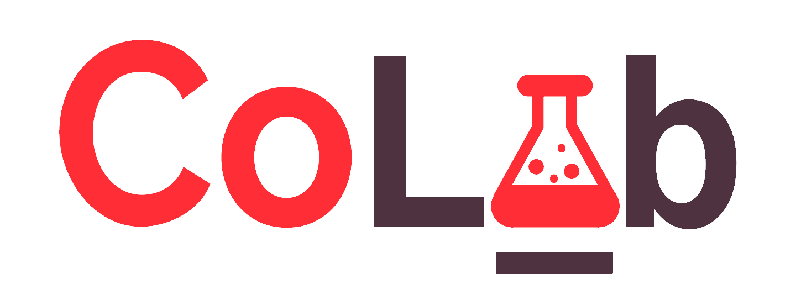

These days, everyone seems glued to their social media,
So we asked:
What if we could bring that kind of engagement to the workplace?
And that's precisely what CoLab is.
We bring the engaging user experience of social media to project management’s doorstep, with engaging user functions like personalized pages and feeds, as well as a kanban project layout. CoLab brings the project to you, to keep you involved like never before.

Build: To run our working app, visit the following URL: http://co-lab-237404.appspot.com.
From there, everything should be pretty straightforward

On the main page, in the top righthand corner there is a login and signup button, choose accordingly

If you chose login, you will be directed to this page in which you would fill in your information and login to your account

If you chose signup, you will be directed to this page in which you would fill in your information to create an account and the submit button will redirect you to the login page where you would use the information you put in to login

File Structure:
/assets: Contains all of the images for our website
/auth: Login and sign up pages
/go_dev: Go package for pushing and pulling to/from database
/static: CSS and JS styling for our site
/templates: HTML templates to be populated with go functions
/view: All of the HTML files for the site
/war: For app engine to serve favicon
/: Our server handlers and sql datbase sit in the main repo

Useful lessons from our code:
-Nested ranges in golang templates
-Implemented gorilla sessions
-asset hosting
-
